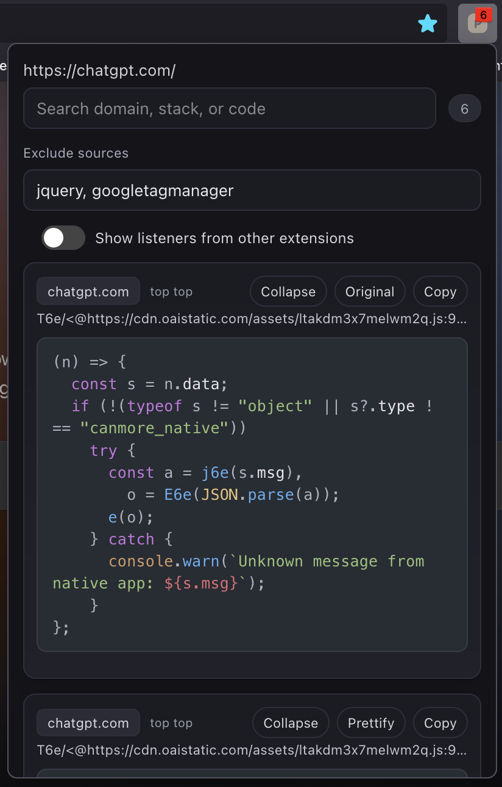

#  Pitok PostMessage Tracker

This extension is a refined and extended version of [postMessage-tracker](https://github.com/fransr/postMessage-tracker) browser extension originally written by [Frans Rosén](https://twitter.com/fransrosen). It improves compatibility, adds Manifest V3 support, Firefox support, and syntax highlighting for better debugging.

<p align="center">

</p>


## 🧩 Extended Features

* Support for Manifest V3
* Works with Firefox
* Improved syntax highlighting
* Better code formatting for easier reading
* Filters postMessages from other extensions

## 🛠️ NPM Development Workflow

This repo now ships an npm-based layout to make development and packaging easier, without changing the core algorithm that finds postMessage listeners.

- Install Node 18+.
- Commands:
  - `npm test` — runs Node tests for popup helpers.
  - `npm run build` — writes packaged extension files to `dist/chrome` and `dist/firefox`.

### Load Unpacked from dist

After running `npm run build`:
- Chrome: load `dist/chrome` as the unpacked extension.
- Firefox: load `dist/firefox` (or zip it to an XPI) as the extension directory.

## 📖 Usage 
###  Chrome

At first you need to clone the repository using:
```bash
git clone https://github.com/hamedsj/PitokPMTracker.git
```

Then you can simply load the extension by going through these steps:
1. Going to [Manage Extensions](chrome://extensions/) section of your chrome
2. Click on `Load Unpacked` button
3. Select the `dist/chrome` folder.

✅ Congratulations you successfully loaded the extension

###  Firefox

You can simply download the latest version of firefox addon from [Release Page](https://github.com/hamedsj/PitokPMTracker/releases) of the repository.

You can also build locally: run `npm run build` and load the `dist/firefox` directory as a temporary extension. To package, zip `dist/firefox` into an `.xpi` and install it.

✅ Congratulations you successfully loaded the extension


## 🔬 Refiners
* [@HamedSj](https://github.com/hamedsj)
* [@Hossein_kd9](https://x.com/hossein_kd9)
* [@0xHoneyBeeSea](https://github.com/0xHoneyBeeSea)
